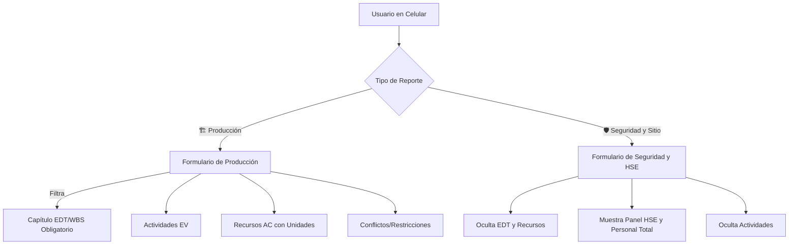

# 🏗️ Documentación Técnica e Integral — Sistema RDO (Reporte Diario de Obra)

Este documento centraliza todo el conocimiento arquitectónico, técnico, operativo y de bases de datos de la plataforma de **Reporte Diario de Obra (RDO)** con control **EVM (Earned Value Management)**. 

---

## 🎯 1. Objetivo General del Proyecto

La aplicación es una plataforma móvil híbrida (HTML5/React/TS/CSS vainilla y Google Sheets/Apps Script) diseñada para el control físico y financiero en tiempo real de proyectos de construcción, basándose en la metodología **EVM (Earned Value Management)**.

Busca resolver la fragmentación del reporte de campo, permitiendo a los capataces y supervisores registrar de manera ágil y controlada:
* **Avance Físico (Earned Value - EV):** Actividades realizadas con metrados comparados contra metas diarias planificadas.
* **Costos Reales (Actual Cost - AC):** Consumos de recursos de mano de obra, materiales y equipos.
* **Control y Seguridad (HSE):** Conteo de personal total en sitio, inspecciones y accidentes.

---

## 🏗️ 2. Arquitectura General y Modos de Operación

El sistema RDO está construido con React y Vite en el frontend, y cuenta con soporte para un backend local en Express o sincronización directa a través de un webhook de Google Sheets.

```
┌─────────────────────────────────────────────────────┐
│                    Frontend (React + Vite)           │
│  ┌───────────┐  ┌────────────────┐  ┌────────────┐  │
│  │  App.tsx   │→│ProjectDashboard│→│ ReportForm │  │
│  │(Orquestador)│ │ (Curva S + KPI) │ │ (Campo)   │  │
│  └───────────┘  └────────────────┘  └────────────┘  │
│         │                                             │
│         ▼                                             │
│  ┌──────────────────┐   ┌────────────────────────┐   │
│  │  data/*.ts       │   │  public/data/*.json    │   │
│  │ (fallbacks       │   │  (static files para    │   │
│  │  embebidos)      │   │   GitHub Pages)        │   │
│  └──────────────────┘   └────────────────────────┘   │
└─────────────────────┬───────────────────────────────┘
                      │ HTTP / Fetch
┌─────────────────────▼───────────────────────────────┐
│               Backend (Express Server)               │
│  ┌───────────┐ ┌──────────┐  ┌──────────────────────┐│
│  │  /api/*   │ │  data/   │  │ Google Sheets        ││
│  │ Endpoints │→│  JSON    │  │ Webhook (Apps Script)││
│  └───────────┘ │  files   │  └──────────────────────┘│
│                └──────────┘                         │
└─────────────────────────────────────────────────────┘
```

### Modos de Operación Soportados:
1. **Modo Servidor (`npm run dev`):** Express sirve `/api/*` con datos reales cargados y guardados en archivos JSON locales.
2. **Modo GitHub Pages (Compilación Estática):** Carga datos de curva S y configuraciones desde `public/data/*.json`. Permite la operación directa de reportes contra Google Sheets sin necesidad de un backend Express intermedio.
3. **Resiliencia / Fallback Total:** Si no hay API disponible ni archivos estáticos accesibles, la aplicación utiliza constantes de datos TypeScript embebidas (`src/data/*-fallback.ts`) para garantizar que la interfaz siga funcionando con datos coherentes.

---

## 🛡️ 3. Arquitectura de Reporte Dual (Producción vs. Seguridad)

Para evitar la distorsión de bases de datos y la duplicación de operarios en obra, la plataforma implementa una **arquitectura dual** con un selector independiente en la cabecera del formulario de campo:



### Reglas de Negocio Clave:
1. **Un reporte de producción = Un frente de trabajo (Capítulo EDT/WBS)**. Esto garantiza la homogeneidad y la integridad para el cálculo de EVM por capítulo del proyecto.
2. **Un reporte de seguridad = Control de sitio global**. No se asocia a ningún código EDT de costo, registrando datos limpios del total de la fuerza laboral y eventos de seguridad.
3. **Validación Dinámica**: En modo *Producción*, el selector de capítulo EDT es obligatorio (`required`). En modo *Seguridad*, este selector se oculta y deja de ser obligatorio en el HTML para evitar bloqueos del navegador en el envío.

### Manejo en Código (`setReportType`):
```typescript
function setReportType(type: "production" | "safety") {
  const isProd = type === "production";
  $("#reportType").value = type;
  
  // Toggles de clases de botones activos/inactivos
  $("#btnTypeProd").className = isProd ? "active-class" : "inactive-class";
  $("#btnTypeSafety").className = !isProd ? "active-class" : "inactive-class";
  
  // Mostrar u ocultar selector de Capítulo
  $("#globalChapterContainer").classList.toggle("hidden", !isProd);
  $("#globalChapter").required = isProd;
  
  // Visibilidad de acordiones del formulario
  ["#activitiesAccordion", "#laborAccordion", "#materialsAccordion", "#equipmentAccordion", "#issuesAccordion"].forEach(id => {
    $(id).classList.toggle("hidden", !isProd);
  });
  $("#safetyAccordion").classList.toggle("hidden", isProd);
}
```

---

## 📊 4. Estructura de la Base de Datos Central (Google Sheets)

El backend en **Google Apps Script** procesa los datos JSON y los distribuye automáticamente en **4 tablas (pestañas)** con diseños y cabeceras HSL estilizadas de alto contraste:

### 1️⃣ `R_Produccion` (Gris Oscuro `#1e293b`)
Registra las cabeceras de producción ligadas a capítulos EDT/WBS.
* **Columnas:** `ID Reporte`, `Fecha Envío`, `Fecha Reporte`, `Supervisor/Ingeniero`, `Turno`, `Clima Mañana`, `Clima Tarde`, `Horas Efectivas`, `Capítulo WBS ID`, `Capítulo WBS Nombre`, `Conflictos/Restricciones`, `Trabajos Mañana`, `Observaciones Generales`.

### 2️⃣ `R_Seguridad` (Verde Esmeralda `#047857`)
Registra las auditorías HSE y el total de personal sin acoplamientos WBS.
* **Columnas:** `ID Reporte`, `Fecha Envío`, `Fecha Reporte`, `Supervisor/Ingeniero`, `Turno`, `Clima Mañana`, `Clima Tarde`, `Personal Total en Obra`, `Inspecciones Realizadas`, `Detalle Inspecciones`, `Accidentes/Incidentes`, `Observaciones Generales`.

### 3️⃣ `Detalle_Actividades` (Gris Pizarra `#334155`)
Desglose detallado del metrado físico ejecutado para la Curva S y EVM.
* **Columnas:** `ID Reporte`, `Fecha Reporte`, `Supervisor/Ingeniero`, `Capítulo WBS ID`, `Actividad WBS ID`, `Nombre Actividad`, `Unidad`, `Meta del Día`, `Cantidad Ejecutada`, `Avance Estimado`, `Observación/Comentario`.

### 4️⃣ `Detalle_Recursos` (Azul Índigo `#4338ca`)
Detalle de costos reales (Mano de Obra, Materiales y Equipos) por capítulo.
* **Columnas:** `ID Reporte`, `Fecha Reporte`, `Supervisor/Ingeniero`, `Tipo Recurso`, `Capítulo WBS ID`, `ID Recurso`, `Descripción Recurso`, `Categoría/Detalle`, `Unidad`, `Cantidad Registrada`.

---

## 🗄️ 5. Estructura de Archivos Maestros (Bases de Datos Excel)

La aplicación carga y autocompleta el formulario usando cuatro archivos Excel maestros ubicados en `./data/`:

### 5.1 `BD_EDT.xlsx` — Estructura WBS/EDT
Define la estructura jerárquica del proyecto (capítulos y actividades).

| Columna | Descripción | Ejemplo |
|---------|-------------|---------|
| `edt_id` | ID numérico del capítulo | 1, 2, 3 |
| `edt_nombre` | Nombre del capítulo (nivel 1) | "Estructuras" |
| `actividad_id` | ID de la actividad (nivel 2) | "3.1", "3.2" |
| `actividad_nombre` | Nombre de la actividad | "Concreto de Columnas" |
| **`codigo`** | **Código corto legible para reportes** | **"EST-03"** |
| `unidad` | Unidad de medida | m3, m2, kg, und |
| `presupuesto_total` | Presupuesto asignado (S/) | 42300.00 |
| `fecha_inicio` | Fecha de inicio planificada | 2026-05-15 |
| `fecha_fin` | Fecha de fin planificada | 2026-08-18 |
| `nivel_wbs` | Nivel jerárquico (1=capítulo, 2=actividad) | 2 |
| `padre_id` | ID del capítulo padre | 1 |

> [!NOTE]
> Se utiliza la columna `codigo` formativa (`${CAPÍTULO}-${SECUENCIA}`) para mapear de forma limpia las actividades y recursos entre los reportes de campo en Sheets y los datos maestros locales, evitando depender de IDs numéricos que varían según proyecto.

### 5.2 `BD_Metrados_Planificados.xlsx` — Línea Base de Avance
Contiene la programación diaria de metrados y valor planificado (PV) para cada actividad del cronograma.

| Columna | Descripción | Ejemplo |
|---------|-------------|---------|
| `fecha` | Fecha de la meta | 2026-05-15 |
| `id_wbs` | Código o ID de la actividad WBS | EST-03 |
| `metrado_diario_planificado` | Cantidad física programada para el día | 15.5 |
| `pv_diario` | Valor planificado del día (S/) | 2092.50 |
| `pv_acumulado` | Valor planificado acumulado (S/) | 2092.50 |

### 5.3 `BD_RRHH.xlsx` — Tarifario de Mano de Obra y Recursos
Define el catálogo de recursos disponibles con sus correspondientes costos unitarios reales.

| Columna | Descripción | Ejemplo |
|---------|-------------|---------|
| `codigo` | Código único del recurso | LH-CAP, MAT-CEM |
| `nombre` | Nombre descriptivo | Capataz de Edificación |
| `tipo` | Tipo: `mano_obra`, `material`, `equipo` | mano_obra |
| `unidad` | Unidad de medida | Hora Hombre, Bolsa |
| `costo_unitario` | Costo unitario base en moneda local | 28.00 |

### 5.4 `BD_Almacen.xlsx` — Catálogo de Materiales y Equipos
Contiene el catálogo unificado de materiales e insumos de almacén y equipos asignables a los frentes de trabajo.

---

## 🔄 6. Pipeline de Procesamiento de Datos

Un conjunto de scripts en Node procesa los archivos Excel maestros para generar los JSON ligeros de producción:

```
Excel (BD_*.xlsx)                          Google Sheets
       │                                        │
       ▼                                        │
scripts/generate-pv-json.cjs                    │
       │                                        │
       ├──→ data/pv-curve.json                  │
       ├──→ data/pv-edt-data.json               │
       ├──→ data/pv-by-chapter.json             │
       ├──→ data/resources.json                 │
       ├──→ public/data/*.json (copia Pages)    │
       │                                        │
       ▼                                        ▼
    server.ts (API)                    Apps Script Webhook
       │                                        │
       ▼                                        ▼
    ┌────────────────────────────────────────────┐
    │              App.tsx                       │
    │  Carga: API → static JSON → fallback TS   │
    │  Pasa datos a ProjectDashboard             │
    └────────────────────────────────────────────┘
```

### JSONs de Datos Generados (`data/`):
* `pv-curve.json`: Curva S completa (177 puntos de fecha, con PV diario y acumulado).
* `pv-edt-data.json`: 40 items del EDT estructurado más 977 valores planificados diarios.
* `pv-by-chapter.json`: PV acumulado de curva S clasificado por capítulos (7 capítulos principales).
* `resources.json`: Catálogo unificado de recursos derivado de `BD_RRHH.xlsx` y `BD_Almacen.xlsx` con costos unitarios reales.

---

## 📈 7. Cálculos de la Metodología EVM (Earned Value)

La aplicación calcula de forma automática y unificada los indicadores clave en `ProjectDashboard.tsx` y al registrar reportes:

| Indicador | Definición / Fórmula | Origen de Datos |
|-----------|----------------------|-----------------|
| **BAC** (Budget at Completion) | Presupuesto total al finalizar el proyecto. | Último `pvCumulative` de la curva S programada. |
| **PV** (Planned Value) | Presupuesto planificado a la fecha de corte. | Valor acumulado de la curva S (`pv-curve.json`) en la fecha. |
| **EV** (Earned Value) | Valor ganado (avance físico valorizado). | `Suma(Cantidad Ejecutada × Precio Unitario de la Actividad)` de todos los reportes hasta la fecha. |
| **AC** (Actual Cost) | Costo real incurrido en la obra. | `Suma(Cantidad Recurso × Costo Unitario del Recurso)` de todos los recursos reportados (Mano de obra, materiales, equipos) hasta la fecha. |
| **CV** (Cost Variance) | `EV - AC` | Valores acumulados. |
| **SV** (Schedule Variance)| `EV - PV` | Valores acumulados contra curva S real. |
| **CPI** (Cost Performance) | `EV / AC` | Índice de rendimiento de costo (>1.0 es ahorro). |
| **SPI** (Schedule Performance)| `EV / PV` | Índice de rendimiento de plazo (>1.0 es adelanto). |
| **% Avance Físico** | `(EV / BAC) × 100` | Porcentaje de avance real del proyecto. |

### Optimizaciones Clave Realizadas:
1. **PV Real por Capítulo:** En lugar de derivar el PV por capítulo desde cantidades sintéticas del formulario, el sistema consulta `pv-by-chapter.json`, asegurando que `Suma(PV Capítulos) === PV Total del Proyecto === BAC`.
2. **SPI Unificado:** Tanto el gráfico de curva S como el historial de reportes consumen la misma lógica de lookup sobre la curva real por fecha, eliminando discrepancias matemáticas.
3. **Unidad Dinámica de Recursos:** Los selectores del formulario de recursos muestran dinámicamente indicadores visuales de unidad (ej. `Bolsa`, `Hora Máquina`, `Hora Hombre`) consultando el catálogo `BD_RRHH` precargado.

---

## 🔑 8. Integración Activa y API Web App de Google Sheets

La aplicación está vinculada directamente mediante la API al backend en **Google Apps Script**.

* **URL Activa de la Web App:**
  `https://script.google.com/macros/s/AKfycby9McwaX9r1Kls2YwYcP1x-fW1aQe5_aWT1qkLLKUM6eiZ5SyLextKCjDk-l-YSMip1mw/exec`
* **Manejo en Frontend:** Configurado en la pestaña **"Despliegue Sheets"** de la aplicación, guardado persistente en el `localStorage` mediante la clave `RDO_APPS_SCRIPT_WEBHOOK` para una resiliencia total.

---

## 📡 9. Rutas de la API del Servidor Express (Local)

El backend de simulación local en `server.ts` sirve los siguientes endpoints REST:

* `GET /api/projects`: Devuelve el catálogo de proyectos activos.
* `GET /api/master-data`: Devuelve la estructura EDT, metrados planificados y recursos combinados.
* `GET /api/resources`: Devuelve el catálogo unificado de recursos.
* `GET /api/pv-curve`: Devuelve los datos de la curva S de valor planificado.
* `GET /api/pv-chapter`: Devuelve el desglose de PV planificado por capítulo EDT.
* `GET /api/reports`: Devuelve el historial de reportes diarios registrados.
* `POST /api/reports`: Registra un nuevo reporte diario de campo en local.

---

## 💻 10. Comandos Útiles de Desarrollo

| Comando | Acción |
|---------|--------|
| `npm install` | Instala las dependencias del proyecto. |
| `npm run dev` | Inicia el servidor de simulación local en Express + Vite (`http://localhost:3000`). |
| `npm run build` | Compila el frontend React a estático y empaqueta el servidor con `esbuild`. |
| `npm run start` | Inicia el backend compilado en producción (`dist/server.cjs`). |
| `npm run lint` | Ejecuta el compilador de TypeScript en modo análisis (`tsc --noEmit`). |
| `node scripts/generate-pv-json.cjs` | Regenera todos los archivos JSON a partir de los Excel maestros en `./data/`. |
| `node scripts/generate-pv-fallback.cjs` | Regenera las constantes TypeScript embebidas de respaldo. |
